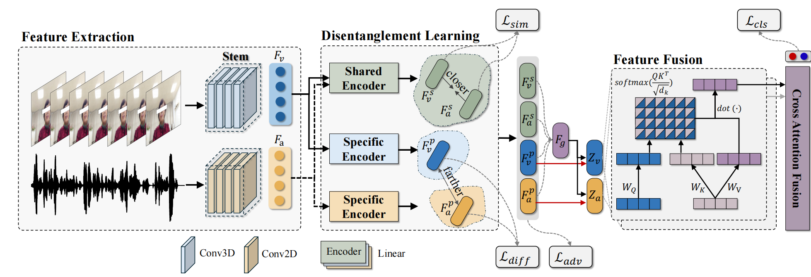
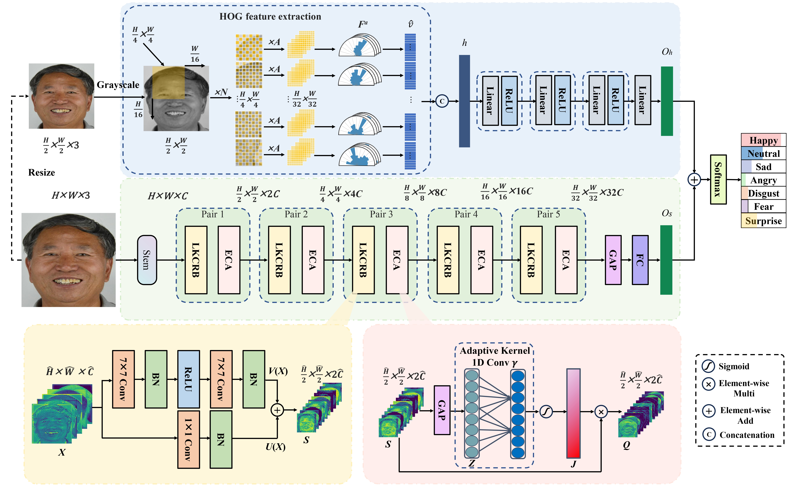
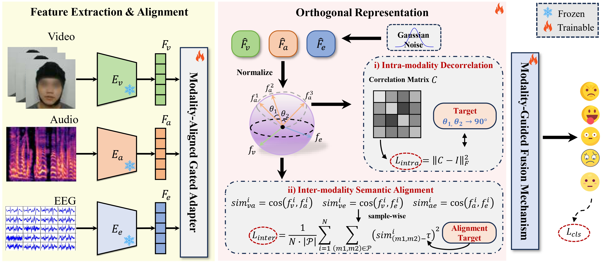








# Short Bio
My name is Hongbin Chen (陈宏斌), and I am currently a second-year Master's student in Biotechnology and Engineering at the [School of Biomedical Engineering and Informatics, Nanjing Medical University](https://english.njmu.edu.cn/), supervised by Prof. [Jianqing Li](https://bmei.njmu.edu.cn/2018/1120/c19988a262557/page.htm) and Assoc. Prof. [Wentao Xiang](https://scholar.google.com/citations?hl=zh-CN&user=-foPGxYAAAAJ&view_op=list_works&sortby=pubdate). I am also a Ph.D. candidate in Clinical Medical Engineering and affiliated with the Jiangsu Province Engineering Research Center for Smart Wearable and Rehabilitation Devices. 

My research interests lie in **Affective Computing**, with a particular focus on multimodal emotion recognition for older adults. 

Let's collaborate! I promise to reply to your email much faster than my deepest neural networks converge.

# 🔥 News

<ul>
  <li><em>2026.04:</em> 🎉🎉 DiVA was accepted by JBHI!</li>
</ul>
<ul>
  <li><em>2026.03:</em> 🎉🎉 ES-DPNet was accepted by IEEE Trans. on Affective Computing!</li>
</ul>
<ul>
  <li><em>2025.08:</em> 🎉🎉 MOFA was accepted by PRCV 2025!</li>
</ul>

# 📝 Publications 
&dagger;: equal contribution, * : corresponding author

<dl>
<dt>
    

      JBHI 2026
      
    

  </dt>
  <dd>
    <a href="https://doi.org/10.1109/JBHI.2026.3679693" class="publication-title">Towards Cognitive Impairment Screening in Elderly Communities with Audio-Visual Modal Disentangled Representation Learning
    </a>
  </dd>
  <dd>Rui Feng, <strong>Hongbin Chen</strong>, Yihao Yao, Liuyu Wu, Tao Liang, Wentao Xiang, Jie Li, Chu Kiong Loo, Junxiao Yu*, Wei Wang*, Jianqing Li*</dd>
  <dd>Journal of Biomedical and Health Informatics <strong>(JBHI)</strong>, 2026</dd>
  <dd>
    <a href="https://github.com/FengRui1998/DiVA" target="_blank" style="text-decoration: none; color: #181717; font-weight: bold;">
      <i class="fab fa-github" style="font-size: 1.2em; margin-right: 5px;"></i>[Code & Project]
    </a>
  </dd>
</dl>

<dl>
<dt>
    

      TAFFC 2026
      
    

  </dt>
  <dd>
    <a href="https://doi.org/10.1109/TAFFC.2026.3679686" class="publication-title">Facial Expression Recognition for Chinese Elderly Using Edge and Semantic features Dual Path Network with Two-step Transfer Learning
    </a>
    <!-- <a href="javascript:alert('The publisher is still brewing the coffee! Paper will be online soon. ☕');" class="publication-title" style="cursor: help;">Facial Expression Recognition for Chinese Elderly Using Edge and Semantic features Dual Path Network with Two-step Transfer Learning
    </a> -->
  </dd>
  <dd>Keke Shi&dagger;, <strong>Hongbin Chen&dagger;</strong>, Keshu Cai, Jinhui Wu, Wei Wang, Jie Li, Bin Liu, Liangcheng Qu, Kuiying Yin, Pasquale Molinaro, Giancarlo Fortino, Jianqing Li, Wentao Xiang*</dd>
  <dd>IEEE Trans. on Affective Computing <strong>(TAFFC)</strong>, 2026</dd>
  <dd>
    <a href="https://github.com/Codenewwer/feresdpnet" target="_blank" style="text-decoration: none; color: #181717; font-weight: bold;">
      <i class="fab fa-github" style="font-size: 1.2em; margin-right: 5px;"></i>[Code & Project]
    </a>
  </dd>
</dl>

<dl>
<dt>
    

      PRCV 2025
      
    

  </dt>
  <dd>
    <a href="https://link.springer.com/chapter/10.1007/978-981-95-5567-3_29" class="publication-title">MOFA: Modality-Orthogonalized Fusion Architecture for Multimodal Emotion Recognition
    </a>
  </dd>
  <dd><strong>Hongbin Chen</strong>, Rui Feng, Jie Li, Wei Wang, Jianqin Li*, Wentao Xiang*</dd>
  <dd>Chinese Conference on Pattern Recognition and Computer Vision <strong>(PRCV)</strong>, 2025</dd>
</dl>

# 🎖 Honors and Awards
- *2025.11* National Graduate Scholarship (Master Student)
- *2025.10* First-Class Graduate Scholarship (Master Student)
- *2024.08* Excellent Undergraduate Thesis Award, Jiangsu Province
- *2024.06* Outstanding Undergraduate Graduate

# 💬 Professional Services
- Conference Reviewer: PRCV (2026).
